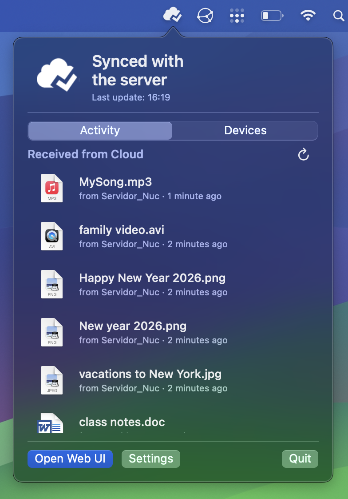
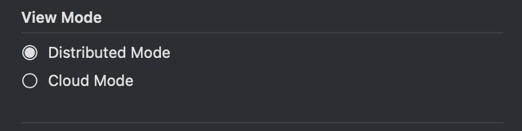
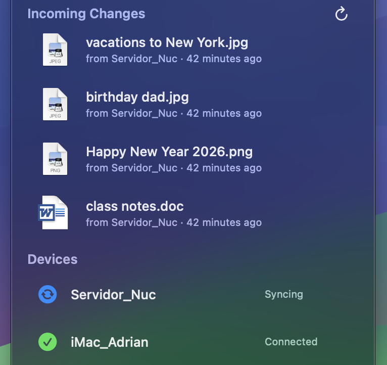
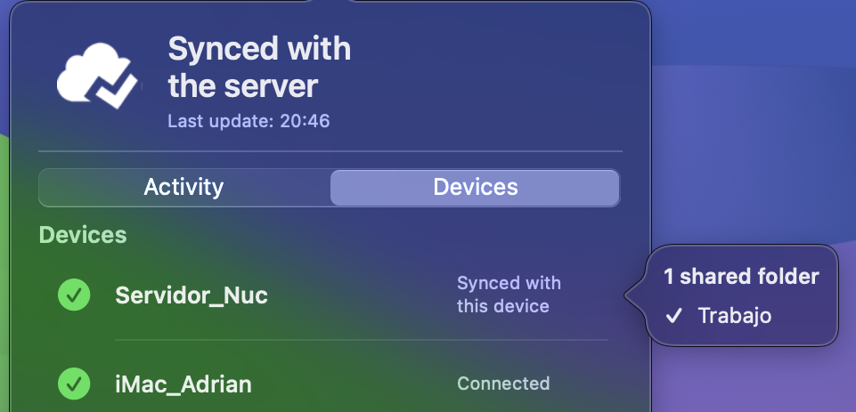
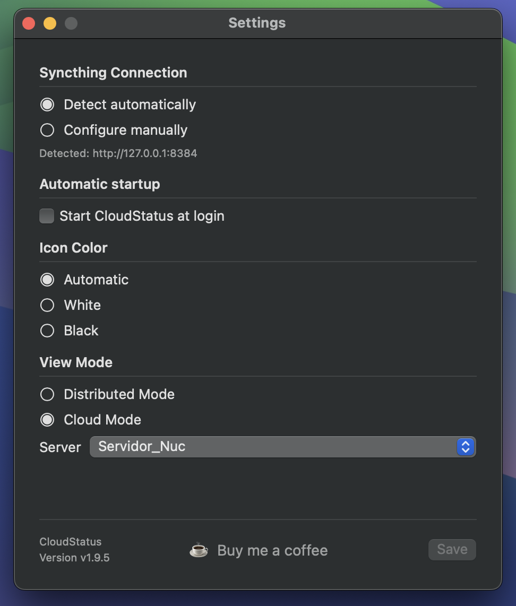
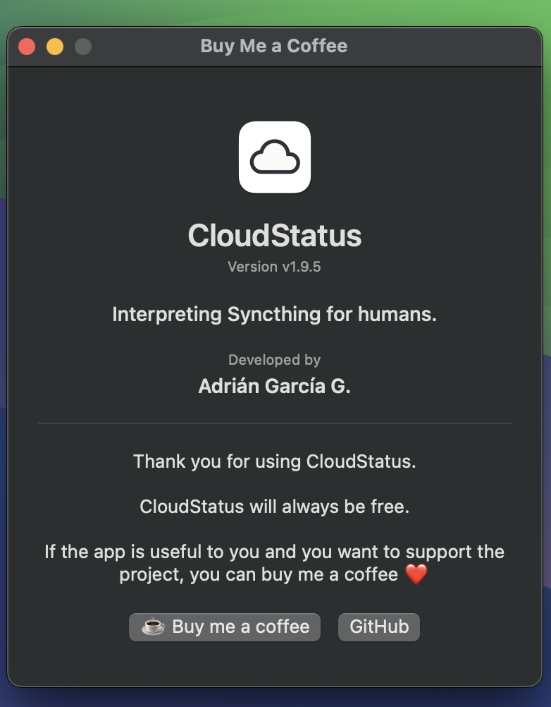

# CloudStatus

> Interpreting Syncthing for humans.

  

## ¿Qué es CloudStatus?

CloudStatus es una aplicación para macOS que vive en la barra de menús y te permite conocer de un vistazo el estado de sincronización de Syncthing.

Su objetivo es muy sencillo: transformar información técnica en información útil.

En lugar de interpretar conexiones, índices o estados difíciles de entender, CloudStatus responde a preguntas mucho más naturales:

- ¿Está todo sincronizado?
- ¿Qué dispositivo está sincronizando?
- ¿Qué archivos acaban de recibirse?
- ¿Necesito hacer algo?

Con un solo vistazo a la nube de la barra de menús sabrás si todo funciona correctamente. Si necesitas más información, CloudStatus muestra una interfaz clara y sencilla donde consultar la actividad reciente, el estado de los dispositivos y cualquier incidencia detectada.

  

La nube cambia automáticamente para reflejar el estado de la sincronización, permitiéndote saber de un vistazo si todo está sincronizado, si hay actividad o si existe algún problema.

CloudStatus no pretende sustituir a Syncthing; pretende hacer que Syncthing sea más fácil de entender.

---

## Características

CloudStatus ha sido diseñado para integrarse de forma natural en macOS y ofrecer únicamente la información que realmente necesitas.

- Dos modos de funcionamiento (Modo Distribuido y Modo Cloud) que adaptan automáticamente la interpretación de la sincronización y la interfaz según tu forma de utilizar Syncthing.
- Una nube en la barra de menús que muestra de forma sencilla el estado de la sincronización.
- Actividad reciente de sincronización.
- Estado de todos los dispositivos conectados.
- Detección visual de incidencias y problemas de sincronización.
- Compatible con los modos claro y oscuro de macOS.
- Configuración sencilla.

---

## ¿Por qué dos modos?

No todas las personas utilizan Syncthing de la misma manera.

Mientras que algunos prefieren una red distribuida donde todos los dispositivos colaboran entre sí, otros utilizan un servidor central como punto principal de sincronización.

Por ese motivo, CloudStatus ofrece dos modos de funcionamiento.

El modo seleccionado no solo cambia la forma de interpretar la sincronización: también adapta automáticamente la interfaz para mostrar la información más relevante en cada escenario.

  

### Modo Distribuido

Pensado para quienes utilizan Syncthing como una red distribuida entre varios dispositivos.

En este modo, la nube de la barra de menús refleja el estado global de la sincronización entre todos los equipos. La actividad y la organización de los dispositivos ofrecen una visión distribuida de toda la red.

### Modo Cloud

Pensado para quienes utilizan un servidor central como punto principal de sincronización.

Es una forma de trabajar similar a Dropbox, OneDrive o iCloud, pero utilizando tu propia infraestructura.

En este modo, CloudStatus toma el servidor como referencia. La nube de la barra de menús, la actividad y la organización de los dispositivos se adaptan automáticamente para ofrecer una visión centrada en el servidor y en el resto de equipos.

## Filosofía

La aplicación intenta integrarse de forma natural en macOS y mantener una interfaz limpia, donde cada elemento tenga un propósito. En lugar de mostrar información técnica, traduce el estado de Syncthing a un lenguaje fácil de entender, para que puedas saber cómo va la sincronización con un simple vistazo.

**Menos datos. Más claridad.**

  

La actividad muestra únicamente la información necesaria para entender qué está ocurriendo, sin sobrecargar la interfaz con datos técnicos.

  

Los dispositivos también priorizan la claridad. Con un clic puedes consultar rápidamente qué carpetas comparte cada equipo.

  

La configuración sigue la misma filosofía: opciones sencillas, bien organizadas e integradas con macOS.

---

## Antes de empezar

Para utilizar CloudStatus necesitas:

- macOS 12 Monterey o posterior.
- Syncthing instalado y configurado.

---

## Mirando al futuro

CloudStatus seguirá evolucionando, pero siempre con la misma filosofía: hacer que entender Syncthing sea cada vez más sencillo.

Estas son algunas de las ideas que me gustaría explorar en futuras versiones:

- Confirmación remota de la sincronización mediante la API externa de Syncthing.
- Notificaciones cuando se detecten conflictos de sincronización.
- Integración con el Finder para mostrar el estado de sincronización directamente en las carpetas.
- Iconos personalizados para las carpetas compartidas de Syncthing con opción de activación.
- Acceso directo a las carpetas sincronizadas desde cada dispositivo mostrado en la aplicación.
- Un asistente de configuración inicial más completo e intuitivo.
- Notificaciones cuando haya nuevas versiones de CloudStatus disponibles.

Como siempre, cualquier nueva función solo tendrá sentido si ayuda a que Syncthing sea un poco más fácil de entender.

---

## Un agradecimiento a Syncthing

CloudStatus no existiría sin Syncthing.

Descubrir Syncthing fue una de esas pequeñas alegrías que te encuentras de vez en cuando. Una herramienta increíble, construida sobre una filosofía que comparto profundamente: el control de tus propios datos, la privacidad y la independencia de servicios de terceros.

CloudStatus nace precisamente de esa admiración por Syncthing.

En ningún momento intenté sustituir a Syncthing ni competir con él. Todo lo contrario: mi único objetivo ha sido ofrecer una forma más sencilla e intuitiva de interpretar la información que Syncthing ya proporciona, especialmente en el uso diario.

Si has llegado hasta aquí sin conocer Syncthing, te animo a descubrirlo. Y si ya formas parte de su comunidad, espero que CloudStatus sea un buen compañero para disfrutarlo todavía más.

---

## Invítame a un café

  

CloudStatus es un proyecto desarrollado en mi tiempo libre y seguirá siendo completamente gratuito.

Si te resulta útil y quieres apoyar su desarrollo, puedes invitarme a un café. Será una forma estupenda de ayudarme a seguir dedicándole tiempo y continuar mejorándolo.

Gracias por darle una oportunidad a CloudStatus.

---

## Agradecimientos

También quiero dar las gracias a ChatGPT. Durante el desarrollo de CloudStatus ha sido el mejor compañero: me ha ayudado a dar forma a cientos de ideas, resolver problemas, revisar el código y escribir esta documentación. Estoy convencido de que este proyecto no habría sido el mismo sin esa colaboración.

---

## Licencia

CloudStatus se distribuye bajo la licencia MIT.

Consulta el archivo `LICENSE` para obtener más información.
